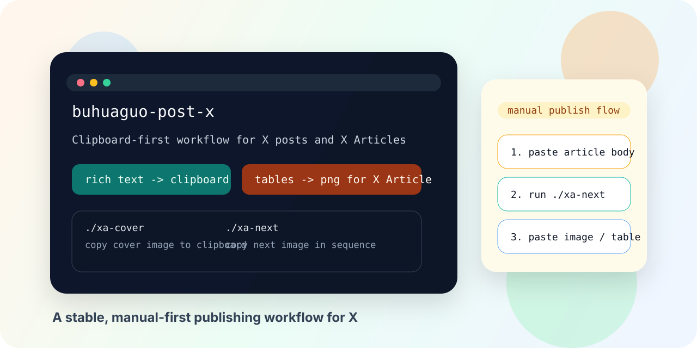

<p align="center">
  
</p>

<p align="center">
  <a href="https://github.com/SIXIANGGUO/buhuaguo-post-x/releases/tag/v1.58.0"></a>
  <a href="./LICENSE"></a>
  
  
  
</p>

# buhuaguo-post-x

Clipboard-first publishing skill for X posts and X Articles.

This repository contains only the `buhuaguo-post-x` skill and its required runtime files. It does not bundle unrelated skills, unrelated utilities, or other publishing workflows.

## At a Glance

- Prepare X posts and X Articles without browser posting automation
- Paste polished article body first, then insert media manually in a stable order
- Turn remote article images into local files automatically
- Turn Markdown tables into local PNG files so they survive the X Article workflow
- Use short helper commands like `./xa-next` and `./xa-cover` during publishing

## Docs

- Installation guide: [INSTALL.md](./INSTALL.md)
- Contribution guide: [CONTRIBUTING.md](./CONTRIBUTING.md)
- Launch copy: [docs/launch-copy.md](./docs/launch-copy.md)

## Workflow


## English

### What It Does

`buhuaguo-post-x` prepares content for X without driving the X UI itself.

It focuses on a practical manual workflow:

- Copy post text or article body to the clipboard
- Replace media with filename-based placeholders
- Keep every image local before insertion
- Let you paste text first and insert images manually

### Why It Is Different

- Clipboard-first: no browser automation for posting to X
- X Article friendly: Markdown articles are converted into pasteable rich text
- Remote-image aware: article images can be downloaded into a local cache automatically
- Table-safe: Markdown tables are rendered into local PNG files because X Articles do not preserve pasted HTML tables
- Image queue helpers: generated short commands like `./xa-next` and `./xa-cover` make article image insertion fast

### Included Capabilities

- Regular posts with image placeholders
- Quote-post comment drafting
- Video-post drafting
- X Article body preparation
- Sequential image-copy helper for article publishing

### Requirements

- `bun` or `npx -y bun`
- `playwright` available in `PATH`
- A working system clipboard on your platform

### Install

Clone or copy this repo, then place the folder in your Claude skills directory:

```bash
mkdir -p ~/.claude/skills
cp -R ./buhuaguo-post-x ~/.claude/skills/buhuaguo-post-x
```

If `playwright` is not already available in your shell, install it first so Markdown tables can be rendered into PNG files:

```bash
npm install -g playwright
```

### Quick Start

Regular post:

```bash
bun scripts/x-browser.ts "Hello world" --image ./photo.png
```

X Article:

```bash
bun scripts/x-article.ts ./article.md
cd "$(dirname ./article.md)"
./xa-cover
./xa-next
```

### Repository Layout

```text
SKILL.md
references/
scripts/
```

### Launch Copy

Ready-to-post announcement copy lives in [docs/launch-copy.md](./docs/launch-copy.md).

### Contributing

See [CONTRIBUTING.md](./CONTRIBUTING.md).

### License

MIT

## 中文说明

## 一眼看懂

- 不做 X 页面自动发布，只做内容准备
- 先粘贴更干净的正文，再按顺序插入图片
- 文章中的远程图片会自动变成本地文件
- Markdown 表格会自动转成 PNG，避免 X Article 吃不下表格
- 插图时可以直接用 `./xa-next`、`./xa-cover` 这类短命令

## 文档入口

- 安装说明：[INSTALL.md](./INSTALL.md)
- 贡献指南：[CONTRIBUTING.md](./CONTRIBUTING.md)
- 发布文案：[docs/launch-copy.md](./docs/launch-copy.md)

### 这个项目做什么

`buhuaguo-post-x` 是一个面向 X 发布流程的剪贴板优先 skill。  
它不去自动控制 X 网页，而是把“准备内容”和“手动发布”拆开，让实际发布过程更稳。

它解决的是这类真实场景：

- 先把正文优雅地粘贴到 X
- 媒体都用文件名占位，方便按顺序插入
- 所有图片都落到本地，避免远程图失控
- 文章发布时，不再反复输入长命令

### 这个 skill 的特色

- 不做 X 页面自动化，只做内容准备和剪贴板交付
- Markdown 文章会转换成更适合粘贴进 X Article 的富文本
- 远程图片会自动下载到本地缓存目录
- Markdown 表格会自动渲染成本地 PNG，因为 X Article 不会保留粘贴进去的 HTML 表格
- 自动生成 `./xa-next`、`./xa-cover` 这类短命令，插图顺手很多

### 包含的能力

- 普通帖子文案准备
- 引用帖评论准备
- 视频帖文案准备
- X Article 正文准备
- 文章图片顺序复制辅助

### 依赖要求

- `bun` 或 `npx -y bun`
- `playwright` 命令可直接在终端中使用
- 系统剪贴板可用

### 安装方式

把这个仓库放到 Claude 的 skills 目录：

```bash
mkdir -p ~/.claude/skills
cp -R ./buhuaguo-post-x ~/.claude/skills/buhuaguo-post-x
```

如果你的终端里还没有 `playwright` 命令，先安装它，这样 Markdown 表格才能自动转成 PNG：

```bash
npm install -g playwright
```

### 快速使用

普通帖子：

```bash
bun scripts/x-browser.ts "你好，X" --image ./photo.png
```

文章发布：

```bash
bun scripts/x-article.ts ./article.md
cd "$(dirname ./article.md)"
./xa-cover
./xa-next
```

### 仓库边界

这个仓库只发布 `buhuaguo-post-x` 自身所需的文件，不包含不相关的 skill、历史残留目录或无关发布脚本。

### 发布文案

可直接复制使用的项目发布文案在 [docs/launch-copy.md](./docs/launch-copy.md)。

### 参与贡献

如果以后你想继续迭代这个项目，可以先看 [CONTRIBUTING.md](./CONTRIBUTING.md)。

### 许可证

MIT
